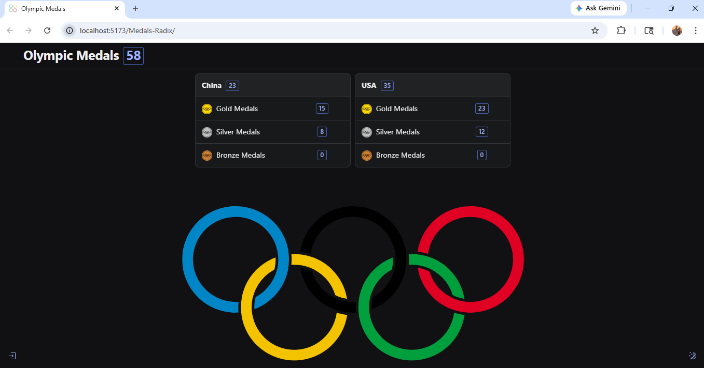

# Olympic Medals Tracker

A React-based frontend application for tracking Olympic medal counts with real-time updates using SignalR, JWT authentication, and Radix UI components.

This project demonstrates modern frontend development concepts including API integration, real-time communication, authentication workflows, state management, and responsive UI design.

---

## Features

### Olympic Medal Dashboard
- Displays medal counts by country
- Gold, silver, and bronze medal tracking
- Dynamic frontend rendering using React

### Real-Time Updates
- SignalR integration for live medal updates
- Frontend automatically updates without page refreshes
- Real-time synchronization across connected users

### JWT Authentication
- User login/logout functionality
- Token-based authentication
- Role-based frontend controls

### CRUD Functionality
- Add new countries
- Update medal counts
- Delete country records
- Protected actions based on user permissions

### Modern UI Components
- Built using Radix UI
- Responsive layout and themed components
- Interactive frontend experience

---

## Technologies Used

### Frontend
- React
- JavaScript
- Vite
- Radix UI

### Real-Time Communication
- SignalR

### Authentication
- JWT Authentication

### Backend Integration
- ASP.NET Core Web API
- REST API consumption

---

## Application Screenshots

### Medal Tracking Dashboard

```md

```

---

## Backend API

This frontend application connects to a separate ASP.NET Core backend API:

```txt
Medals-Api
```

The backend handles:
- Authentication
- Database persistence
- SignalR hubs
- Medal data management

---

## Running the Application

### Clone Repository

```bash
git clone https://github.com/gfarley1217/olympic-medals-tracker.git
```

### Install Dependencies

```bash
npm install
```

### Start Development Server

```bash
npm run dev
```

### Build Production Version

```bash
npm run build
```

---

## Key Concepts Demonstrated

- React component architecture
- REST API integration
- JWT authentication handling
- SignalR real-time communication
- State management with React hooks
- Role-based UI rendering
- Frontend/backend integration
- Responsive UI design

---

## Future Improvements

- Advanced filtering and sorting
- Country search functionality
- Medal analytics dashboard
- User profile management
- Mobile-first UI enhancements
- Deployment pipeline improvements

---

## Author

Grant Farley

GitHub:
https://github.com/gfarley1217
